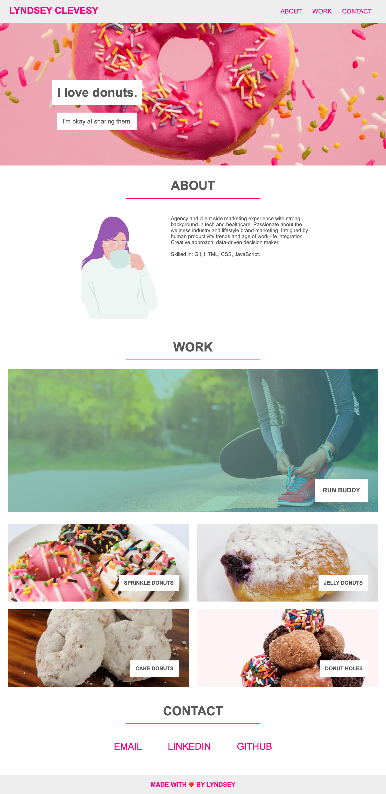
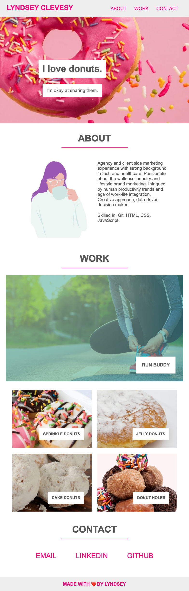
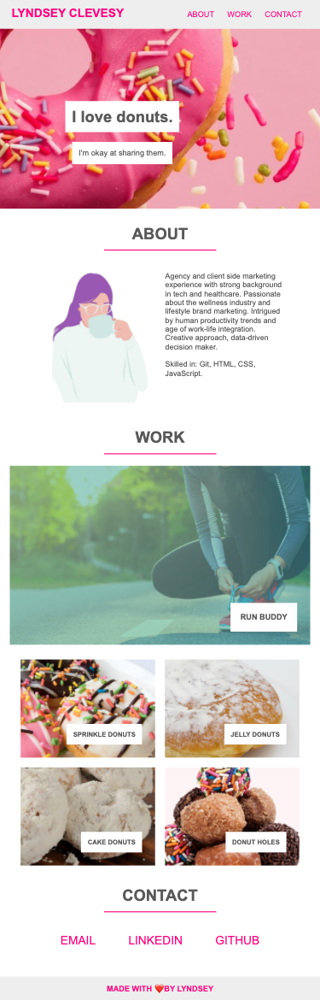

## Professional Portfolio Challenge

# Purpose
This challenge is to build a portfolio website from scratch using HTML and CSS. Tools that should be leveraged include flexbox, media queries, and CSS variables. Content must include a photo or avatar, an about section, a work section, and a contact section. Layout must be responsive across multiple screen sizes. 

# URLs 
* Repo: https://github.com/lyndsclev/portfolio-challenge
* Deployed app: https://lyndsclev.github.io/portfolio-challenge/ 

# Images 
* Desktop

* 980px Breakpoint *Note, the breakpoint in the CSS is actually 999px, because that is where the images needed adjusting. 

* iPhone SE

